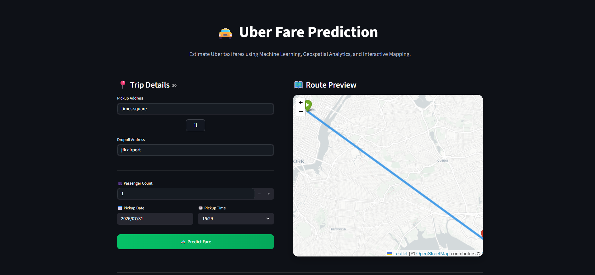
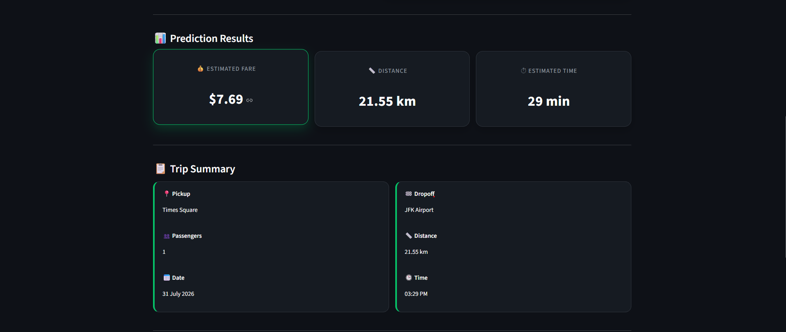
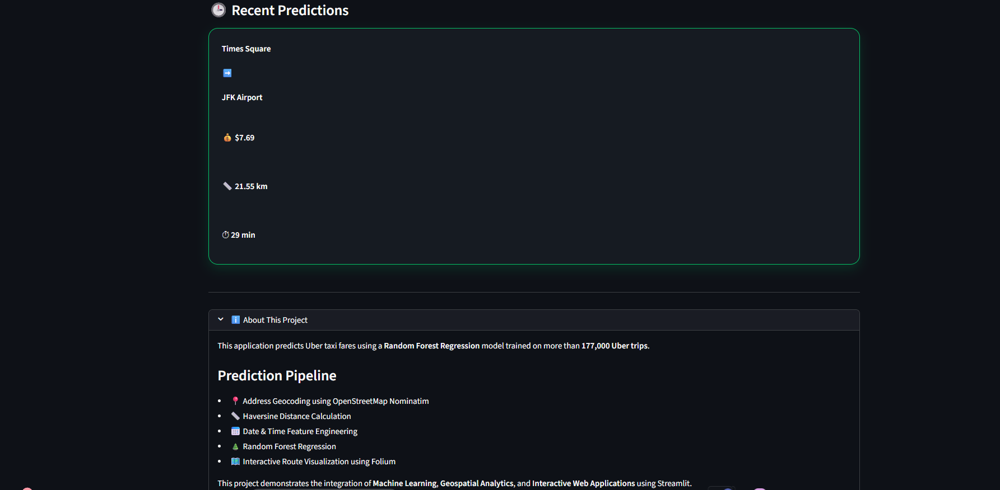

# 🚖 Uber Fare Prediction


Estimate Uber taxi fares using **Machine Learning**, **Geospatial Analytics**, and an **Interactive Streamlit Dashboard**.

---

## 🌐 Live Demo

👉 **Try the application here:**  
**https://uber-fare-prediction-b75r.onrender.com/**

> Replace the above URL with your Render deployment link after deployment.

---

## 📸 Preview

### 🏠 Home Page



### 🗺️ Route Preview & Fare Prediction



### 📊 Trip History



---

## 📖 Project Overview

Uber fare estimation depends on multiple factors such as:

- Pickup & Dropoff locations
- Travel distance
- Pickup date & time
- Passenger count

This project predicts taxi fares using a **Random Forest Regressor** trained on historical Uber trip data. The application provides an intuitive interface where users can enter trip details, visualize the route on a map, and instantly receive a fare estimate.

---

## ✨ Features

- 🚖 Predict Uber fare in real time
- 📍 Address-to-coordinate geocoding
- 🗺️ Interactive route visualization using Folium
- 📏 Automatic distance calculation (Haversine Formula)
- ⏱️ Estimated travel time
- 👥 Passenger count selection
- 📅 Pickup date & time selection
- 📜 Recent prediction history
- 🌙 Modern responsive dark-themed UI

---

## 🛠️ Tech Stack

### Machine Learning
- Scikit-learn
- Random Forest Regressor
- Joblib

### Data Processing
- Pandas
- NumPy

### Web Application
- Streamlit
- Streamlit-Folium

### Mapping & Geospatial
- Folium
- Geopy
- OpenStreetMap (Nominatim)

---

## 📂 Project Structure

```text
Uber-Fare-Prediction/
│
├── app.py
├── requirements.txt
├── README.md
│
├── assets/
│   └── styles.css
│
├── data/
│   └── uber.csv
│
├── images/
│   ├── home.png
│   ├── prediction.png
│   └── history.png
│
├── models/
│   ├── random_forest_model.pkl
│   └── model_features.pkl
│
├── notebook/
│   └── Uber_Fare_Prediction.ipynb
│
└── utils/
    ├── predictor.py
    ├── geocoder.py
    └── distance.py
```

---

## ⚙️ Installation

Clone the repository:

```bash
git clone https://github.com/harsh8767/Uber-Fare-Prediction.git
```

Move into the project directory:

```bash
cd Uber-Fare-Prediction
```

Install dependencies:

```bash
pip install -r requirements.txt
```

---

## ▶️ Run Locally

Start the Streamlit application:

```bash
streamlit run app.py
```

The application will open in your browser.

---

## 🤖 Machine Learning Model

### Model Used

- Random Forest Regressor

### Features Used

- Pickup Latitude
- Pickup Longitude
- Dropoff Latitude
- Dropoff Longitude
- Passenger Count
- Year
- Month
- Day
- Hour
- Day of Week
- Distance (Haversine)

---

## 📈 Model Performance

| Metric | Score |
|---------|--------:|
| **R² Score** | **0.7824** |
| **RMSE** | **1.9394** |
| **MAE** | **1.3350** |

---

## 🌍 Deployment

The application is deployed using **Render**.

To deploy:

1. Push the project to GitHub.
2. Create a new Render Web Service.
3. Set the build command:

```bash
pip install -r requirements.txt
```

4. Set the start command:

```bash
streamlit run app.py --server.port=$PORT --server.address=0.0.0.0
```

---

## 🔮 Future Improvements

- Live traffic estimation
- Surge pricing prediction
- Weather-based fare adjustment
- Support for multiple cities
- Deep Learning models
- Ride category selection (UberX, UberXL, Black, etc.)
- Fare confidence intervals

---

## 👨‍💻 Author

**Harsh Chavan**

GitHub: https://github.com/harsh8767

---

## ⭐ Support

If you found this project helpful, consider giving it a ⭐ on GitHub!
